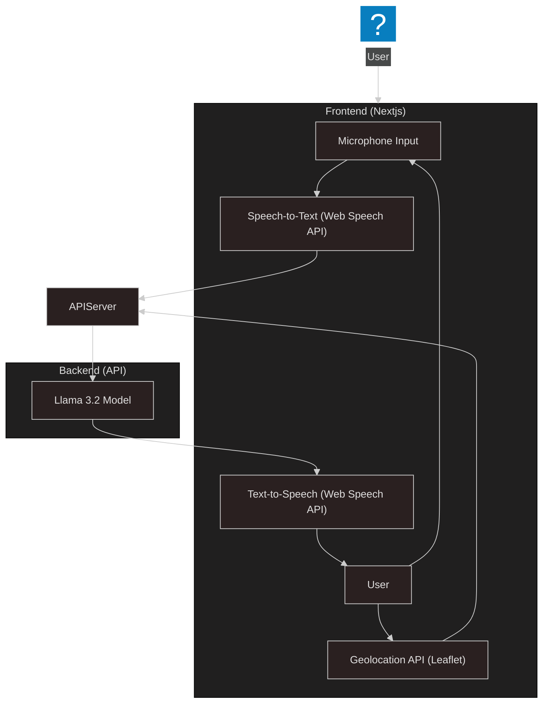

```mermaid
---
config:
  theme: neo-dark
---
flowchart TD
 subgraph subGraph0["Frontend (Nextjs)"]
        MicInput["Microphone Input"]
        User["User"]
        Location["Geolocation API (Leaflet)"]
        STT["Speech-to-Text (Web Speech API)"]
        TTS["Text-to-Speech (Web Speech API)"]
  end
 subgraph subGraph1["Backend (API)"]
        LLM["Llama 3.2 Model"]
  end
    User --> MicInput & Location
    MicInput --> STT
    STT --> APIServer["APIServer"]
    Location --> APIServer
    APIServer --> LLM
    LLM --> TTS
    TTS --> User
    n1["User"] --> subGraph0
    n1@{ icon: "fa:user", pos: "b"}
```