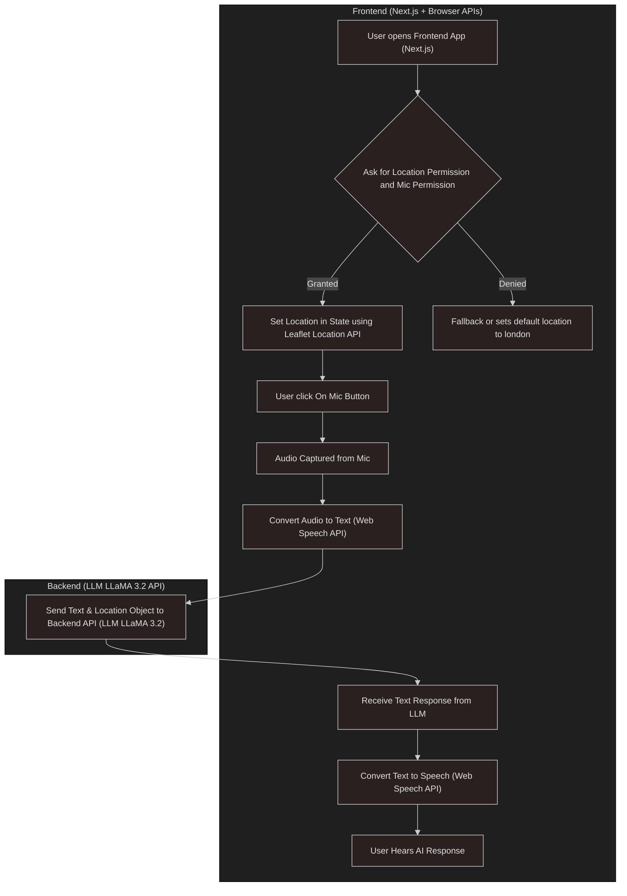

```mermaid
---
config:
  theme: neo-dark
---
flowchart TD

  subgraph Frontend ["Frontend (Next.js + Browser APIs)"]
    A["User opens Frontend App (Next.js)"] --> B{"Ask for Location Permission and Mic Permission"}
    B -->|"Granted"| C["Set Location in State using Leaflet Location API"]
    B -->|"Denied"| D["Fallback or sets default location to london"]

    C --> E["User click On Mic Button"]
    E --> F["Audio Captured from Mic"]
    F --> G["Convert Audio to Text (Web Speech API)"]
    I --> J["Convert Text to Speech (Web Speech API)"]
    J --> K["User Hears AI Response"]
  end

  subgraph Backend ["Backend (LLM LLaMA 3.2 API)"]
    G --> H["Send Text & Location Object to Backend API (LLM LLaMA 3.2)"]
    H --> I["Receive Text Response from LLM"]
  end

```