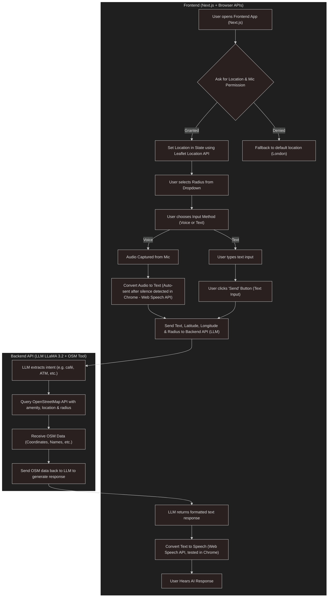

```mermaid
---
config:
  theme: neo-dark
---
flowchart TD

  subgraph Frontend ["Frontend (Next.js + Browser APIs)"]
    A["User opens Frontend App (Next.js)"] --> B{"Ask for Location & Mic Permission"}
    B -->|"Granted"| C["Set Location in State using Leaflet Location API"]
    B -->|"Denied"| D["Fallback to default location (London)"]

    C --> R["User selects Radius from Dropdown"]
    R --> E["User chooses Input Method (Voice or Text)"]

    E -->|"Voice"| F["Audio Captured from Mic"]
    F --> G["Convert Audio to Text (Auto-sent after silence detected in Chrome - Web Speech API)"]
    G --> U

    E -->|"Text"| T["User types text input"]
    T --> S["User clicks 'Send' Button (Text Input)"]
    S --> U

    I --> J["Convert Text to Speech (Web Speech API, tested in Chrome)"]
    J --> K["User Hears AI Response"]
  end

  subgraph Backend ["Backend API (LLM LLaMA 3.2 + OSM Tool)"]
    U["Send Text, Latitude, Longitude & Radius to Backend API (LLM)"] --> H["LLM extracts intent (e.g. café, ATM, etc.)"]
    H --> M["Query OpenStreetMap API with amenity, location & radius"]
    M --> N["Receive OSM Data (Coordinates, Names, etc.)"]
    N --> O["Send OSM data back to LLM to generate response"]
    O --> I["LLM returns formatted text response"]
  end

```