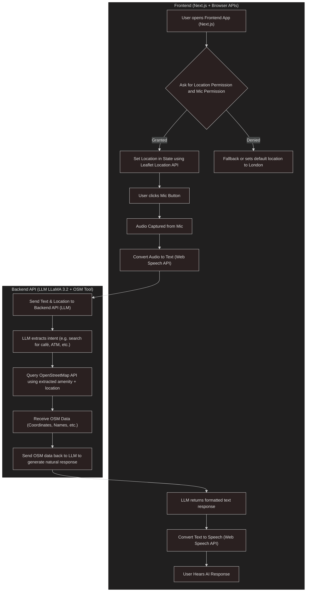

```mermaid
---
config:
  theme: neo-dark
---
flowchart TD

  subgraph Frontend ["Frontend (Next.js + Browser APIs)"]
    A["User opens Frontend App (Next.js)"] --> B{"Ask for Location Permission and Mic Permission"}
    B -->|"Granted"| C["Set Location in State using Leaflet Location API"]
    B -->|"Denied"| D["Fallback or sets default location to London"]

    C --> E["User clicks Mic Button"]
    E --> F["Audio Captured from Mic"]
    F --> G["Convert Audio to Text (Web Speech API)"]
    I --> J["Convert Text to Speech (Web Speech API)"]
    J --> K["User Hears AI Response"]
  end

  subgraph Backend ["Backend API (LLM LLaMA 3.2 + OSM Tool)"]
    G --> H["Send Text & Location to Backend API (LLM)"]
    H --> L["LLM extracts intent (e.g. search for café, ATM, etc.)"]
    L --> M["Query OpenStreetMap API using extracted amenity + location"]
    M --> N["Receive OSM Data (Coordinates, Names, etc.)"]
    N --> O["Send OSM data back to LLM to generate natural response"]
    O --> I["LLM returns formatted text response"]
  end

```